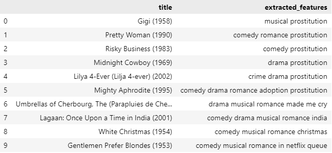

# Laporan Proyek Machine Learning - Konstan Aftop Anewata Ndruru

## Project Overview

Di era digital saat ini, industri perfilman dan platform streaming tumbuh pesat, menyediakan jutaan pilihan film kepada pengguna. Namun, kelimpahan konten ini justru menciptakan masalah baru: overload informasi. Pengguna sering kali merasa kewalahan dan kesulitan menemukan film yang sesuai dengan selera atau minat mereka. Hal ini dapat menyebabkan penurunan engagement pengguna, waktu tonton yang tidak optimal, dan bahkan churn (berhenti berlangganan) karena pengguna tidak lagi merasakan nilai dari platform yang ada. Mereka menghabiskan lebih banyak waktu mencari daripada menonton, dan akhirnya mungkin tidak menemukan apa pun yang menarik.

Pentingnya mengatasi masalah ini sangat krusial bagi platform film. Sistem yang mampu menyajikan film yang relevan secara personal kepada setiap pengguna dapat meningkatkan kepuasan pengguna, memperpanjang durasi tonton, dan pada akhirnya meningkatkan retensi pelanggan. Dengan kata lain, membantu pengguna menemukan film yang mereka cintai bukan hanya tentang kenyamanan, tetapi juga tentang keberlanjutan bisnis platform itu sendiri.

Di sinilah machine learning hadir sebagai solusi yang powerful. Dengan menganalisis data historis preferensi pengguna, seperti riwayat tontonan, rating yang diberikan, genre favorit, atau bahkan interaksi pengguna lain, machine learning dapat mengidentifikasi pola-pola tersembunyi. Pola ini kemudian digunakan untuk memprediksi film apa yang kemungkinan besar akan disukai oleh pengguna tertentu. Sistem rekomendasi yang didukung machine learning dapat bertindak sebagai "kurator pribadi" bagi setiap pengguna, secara proaktif menyarankan konten yang paling sesuai dan menarik, sehingga mengubah pengalaman menonton dari yang awalnya memusingkan menjadi menyenangkan dan personal.

Pentingnya sistem rekomendasi dalam mengatasi masalah information overload dan meningkatkan pengalaman pengguna telah banyak dibahas dalam literatur. Contohnya, Aggarwal et al. (2016) dalam bukunya menjelaskan secara komprehensif berbagai teknik dan aplikasi sistem rekomendasi dalam berbagai domain, termasuk media digital, menegaskan perannya yang krusial dalam personalisasi konten [1].

### Referensi
<br>[1] Aggarwal, C. C. (2016). Recommender Systems: The Textbook. Springer.

## Business Understanding

### Problem Statements
1. Pengguna platform film kesulitan menemukan film yang sesuai dengan preferensi mereka di tengah banyaknya pilihan, yang mengakibatkan overload informasi dan membuang waktu.
2. Tingkat engagement pengguna dan waktu tonton pada platform film berpotensi rendah karena kurangnya personalisasi, sehingga pengguna cenderung tidak menjelajahi konten lebih lanjut atau kembali untuk menonton film.
### Goals
1. Mengembangkan sistem rekomendasi film yang mampu menyarankan film relevan kepada pengguna berdasarkan riwayat tontonan dan preferensi mereka, mempermudah proses penemuan konten.
2. Meningkatkan personalisasi pengalaman pengguna untuk mendorong engagement dan waktu tonton, dengan menyediakan rekomendasi film yang secara proaktif menarik minat mereka.
### Solution Approach
Untuk membangun sistem rekomendasi film yang personal dan relevan, kami mengusulkan dua pendekatan utama:
1. Content-Based Filtering:
Merekomendasikan film berdasarkan kemiripan atribut film (genre, sutradara, aktor, sinopsis) dengan film yang disukai pengguna sebelumnya.
Cara Kerja: Menganalisis metadata film dan menghitung kemiripan (misalnya, cosine similarity) untuk menemukan film serupa.
2. Collaborative Filtering Model Based Deep Learning:
Memanfaatkan deep learning untuk mempelajari pola interaksi kompleks antara pengguna dan film dari data rating atau tontonan.
Cara Kerja: Menggunakan arsitektur jaringan saraf (seperti Neural Collaborative Filtering atau Autoencoders) untuk memodelkan preferensi pengguna dan memprediksi film yang akan disukai, menangkap hubungan non-linier yang lebih dalam.

## Data Understanding
Pada proyek ini, kami menggunakan MovieLens Latest Datasets (Small) yang diperoleh dari GroupLens melalui tautan https://grouplens.org/datasets/movielens/. Dataset ini merupakan salah satu standar benchmark yang umum digunakan dalam penelitian sistem rekomendasi. Versi "Small" dari dataset ini, yang terakhir diperbarui pada September 2018, mencakup 100.000 rating dan 3.600 aplikasi tag yang diterapkan pada 9.000 film oleh 600 pengguna.

Setelah melalui tahapan preprocessing awal, dataframe final yang digunakan untuk pemodelan terdiri dari 3476 entri (baris) dan 6 atribut (kolom). Kondisi data pada dataframe final ini sangat baik, dengan tidak adanya nilai yang hilang (non-null count 3476 untuk semua kolom), yang akan mempermudah proses data preparation selanjutnya. 

| Nama Variabel | Deskripsi                                                                 | Tipe Data         |
|---------------|---------------------------------------------------------------------------|-------------------|
| userId        | Merupakan identifikasi unik untuk setiap pengguna                         | integer           |
| movieId       | Merupakan identifikasi unik untuk setiap film                             | integer           |
| rating        | Menunjukkan rating yang diberikan oleh pengguna terhadap film tertentu    | float             |
| tag           | Merepresentasikan tag atau kata kunci deskriptif yang terkait dengan film | object / string   |
| title         | Merupakan judul dari film                                                 | object / string   |
| genres        | Menunjukkan kategori genre dari film, dipisahkan oleh karakter tertentu   | object / string   |


### Exploratory Data Analysis
1. <b>Distribusi Rating</b>

<p>Secara keseluruhan, rating dari data film yang ada cukup baik dengan nilai paling banyak di range 4 sampai dengan 5.

2. <b>Frekuensi Genre</b>

<p> Berdasarkan grafik diperoleh bahwa genre Drama merupakan yang paling banyak ditonton. Diikuti comedy dan thriller.

## Data Preparation

Tahapan data preparation dilakukan untuk mempersiapkan data agar sesuai dengan format yang dibutuhkan oleh kedua model rekomendasi: **Content-Based Filtering** dan **Collaborative Filtering Model Based Deep Learning**.  
Meskipun dataframe final sudah bersih dari nilai yang hilang (non-null), beberapa transformasi spesifik masih diperlukan.

---

### 1. Persiapan Data untuk Content-Based Filtering

Untuk model Content-Based Filtering, fokus utamanya adalah pada **atribut film** (`genres` dan `tag`) yang akan digunakan untuk mengidentifikasi kemiripan antar film.

#### a. Agregasi Fitur Film
Data diagregasi berdasarkan judul film (`title`) untuk memastikan setiap film memiliki satu representasi unik dari genre dan tag-nya:

- Kolom `genres` diambil nilai pertamanya (`first`).
- Kolom `tag` digabungkan menjadi satu string dengan tag-tag unik yang dipisahkan oleh spasi. Ini menciptakan representasi tekstual yang komprehensif dari semua tag yang terkait dengan film.

```python
df_final_content_based = df_final.groupby('title').agg({
    'genres': 'first',
    'tag': lambda x: ' '.join(set(x))
}).reset_index()
```
#### b. Pembersihan dan Penggabungan Fitur Konten
- Kolom genres dibersihkan dengan menghapus karakter pemisah (|) dan menggantinya dengan spasi, memudahkan tokenisasi teks.
- Kolom genres_clean dan tag (yang sudah digabung) kemudian digabungkan menjadi satu kolom baru bernama content_based_features. Seluruh teks diubah menjadi huruf kecil (.str.lower()) untuk memastikan konsistensi dan menghindari duplikasi karena perbedaan kapitalisasi. Kolom inilah yang nantinya akan digunakan untuk menghitung kemiripan konten antar film.
```python
df_final_content_based['genres_clean'] = df_final_content_based['genres'].str.replace('|', ' ', regex=False)
df_final_content_based['content_based_features'] = (
    df_final_content_based['genres_clean'].str.lower() + ' ' + df_final_content_based['tag'].str.lower()
)
```

#### Alasan: 
Tahap ini diperlukan untuk mengubah data film yang terstruktur menjadi format tekstual yang dapat diproses oleh algoritma pemrosesan bahasa alami (NLP) seperti TF-IDF, yang esensial untuk menghitung kemiripan konten antar film. Dengan menggabungkan genre dan tag, kami menciptakan profil konten yang kaya untuk setiap film.

### 2. Persiapan Data untuk Collaborative Filtering Model Based Deep Learning
Untuk model Collaborative Filtering berbasis Deep Learning, data perlu dipersiapkan dalam format yang memungkinkan model untuk belajar embedding pengguna dan film dari (`interaksi rating`).
#### a. Pemilihan Kolom Relevan
Dataset awal (df_final) difokuskan hanya pada kolom yang esensial untuk model kolaboratif, yaitu userId, movieId, rating, serta genres dan tag yang mungkin akan digunakan sebagai fitur kontekstual.
```python
df_final_collaborative = df_final[['userId','movieId','rating','genres','tag']]
```
#### b. Encoding ID Pengguna dan Film
- userId dan movieId yang awalnya berupa ID unik diubah menjadi indeks numerik berurutan (0, 1, 2, ...) menggunakan proses encoding. Ini penting karena model deep learning biasanya memerlukan input berupa indeks integer untuk embedding layer.
- Dibuat juga pemetaan balik dari indeks ter-encode ke ID asli (user_encoded_to_user, movie_encoded_to_movie) untuk memudahkan interpretasi hasil rekomendasi.
```python
user_ids = df_final_collaborative['userId'].unique().tolist()
user_to_user_encoded = {x: i for i, x in enumerate(user_ids)}
user_encoded_to_user = {i: x for i, x in enumerate(user_ids)}

movie_ids = df_final_collaborative['movieId'].unique().tolist()
movie_to_movie_encoded = {x: i for i, x in enumerate(movie_ids)}
movie_encoded_to_movie = {i: x for i, x in enumerate(movie_ids)}
```
#### Alasan :
Proses encoding ini sangat krusial. Model deep learning tidak dapat secara langsung memproses ID string atau ID numerik yang tidak berurutan. Dengan mengubahnya menjadi indeks berurutan, kami dapat menggunakan embedding layer yang efisien untuk mempelajari representasi vektor (embedding) untuk setiap pengguna dan film, yang merupakan dasar dari model Collaborative Filtering berbasis Deep Learning.

## Modeling
Tahapan ini membahas pembangunan dan implementasi model sistem rekomendasi yang dirancang untuk menyelesaikan permasalahan yang telah diidentifikasi. Proyek ini mengusulkan dua solusi rekomendasi dengan pendekatan yang berbeda: Content-Based Filtering dan Collaborative Filtering Model Based Deep Learning.

### 1. Content-Based Filtering
Model Content-Based Filtering fokus pada atribut intrinsik film untuk merekomendasikan film yang serupa dengan preferensi pengguna di masa lalu.
#### Vektorisasi Fitur Konten:
Untuk mengubah content_based_features (yang berisi gabungan genre dan tag) menjadi representasi numerik yang dapat diolah, digunakan TfidfVectorizer. TfidfVectorizer (Term Frequency-Inverse Document Frequency) membantu menimbang pentingnya kata-kata dalam dokumen (content_based_features) relatif terhadap keseluruhan korpus. analyzer='word' memastikan tokenisasi per kata, min_df=0.0 berarti tidak ada batas minimum frekuensi dokumen untuk sebuah kata, dan stop_words='english' menghilangkan kata-kata umum dalam bahasa Inggris yang tidak informatif.

```python

tf = TfidfVectorizer(analyzer='word', min_df=0.0, stop_words='english')
tf.fit(df_final_content_based['content_based_features'])
tfidf_matrix = tf.fit_transform(df_final_content_based['content_based_features'])
tfidf_matrix yang dihasilkan akan memiliki dimensi (jumlah_film, jumlah_fitur_unik_tfidf).
```
#### Perhitungan Kemiripan
Untuk menentukan seberapa mirip satu film dengan film lainnya berdasarkan kontennya, digunakan cosine similarity. Cosine similarity mengukur kosinus sudut antara dua vektor non-nol dan sering digunakan dalam konteks teks karena efektif dalam ruang berdimensi tinggi. Hasilnya adalah matriks kemiripan (cosine_sim) di mana setiap entri menunjukkan kemiripan antara dua film.
```python
from sklearn.metrics.pairwise import cosine_similarity
cosine_sim = cosine_similarity(tfidf_matrix)
cosine_sim_df = pd.DataFrame(cosine_sim, index=df_final_content_based['title'], columns=df_final_content_based['title'])
```

#### Membangun Rekomendasi Top-N:
Fungsi rekomendasi akan mengambil judul film yang disukai pengguna sebagai input. Pertama, ia mencari indeks film tersebut dalam cosine_sim_df. Kemudian, ia mengambil semua skor kemiripan film tersebut dengan film lain, mengurutkannya dari yang paling mirip, dan mengembalikan judul N film teratas yang paling mirip.

#### Kelebihan Content-Based Filtering:
- Mampu merekomendasikan film baru yang belum pernah dilihat pengguna lain (cold start problem untuk item) selama metadata film tersedia.
- Rekomendasi mudah dijelaskan karena didasarkan pada atribut film yang jelas.
Tidak memerlukan data interaksi dari banyak pengguna untuk memulai.
#### Kekurangan Content-Based Filtering:
- Terbatas pada fitur yang tersedia. Jika fitur film kurang detail, rekomendasi mungkin kurang bervariasi.
- Kesulitan merekomendasikan film yang benar-benar baru atau di luar preferensi historis pengguna (tidak ada "eksplorasi").
#### Rekomendasi 10 Terbaik Content Based Filtering
Jika pengguna menyukai film "Sweet Charity (1969)" dengan fitur konten "comedy drama musical romance prostitution", berikut adalah 10 rekomendasi film teratas yang serupa berdasarkan kemiripan konten:

### 2. Collaborative Filtering Model Based Deep Learning
Model ini memanfaatkan arsitektur deep learning untuk mempelajari embedding pengguna dan film dari pola rating, yang kemudian digunakan untuk memprediksi rating atau memberikan rekomendasi.

#### Arsitektur Model (RecommenderNet)
Model RecommenderNet dibangun menggunakan TensorFlow Keras, mengimplementasikan pendekatan Matrix Factorization dengan embedding layers yang dioptimalkan.
#### Embedding Layers
Dua lapisan embedding terpisah digunakan untuk userId dan movieId. Setiap pengguna dan film dipetakan ke vektor representasi laten (embedding_size=50 dimensi). Inisialisasi bobot dilakukan dengan he_normal untuk stabilitas pelatihan dan ditambahkan regularizer l2 (1e-6) untuk mencegah overfitting.
#### Bias Layers
Selain embedding vektor, model juga menyertakan bias terpisah untuk setiap pengguna dan film. Bias ini menangkap tendensi rata-rata pengguna untuk memberikan rating tertentu atau tendensi rata-rata film untuk menerima rating tertentu, terlepas dari interaksi spesifik.
#### Proses call
- Input model adalah sepasang (userId, movieId).
- Vektor embedding dan bias masing-masing pengguna dan film diambil.
- Kecocokan antara vektor pengguna dan vektor film dihitung menggunakan dot product (tf.tensordot). Ini adalah inti dari matrix factorization, di mana preferensi pengguna terhadap film dimodelkan sebagai hasil perkalian vektor laten mereka.
- Nilai bias pengguna dan film ditambahkan ke hasil dot product.
- Fungsi aktivasi sigmoid diterapkan pada hasil akhir. Sigmoid mengubah nilai output ke dalam rentang [0, 1], yang sering digunakan untuk memprediksi probabilitas atau menormalkan rating agar sesuai dengan skala tertentu (misalnya, jika rating asli 1-5, ini bisa diskalakan kembali setelah prediksi).

```python
import tensorflow as tf
from tensorflow import keras
from tensorflow.keras import layers

class RecommenderNet(tf.keras.Model):
    def __init__(self, num_users, num_movies, embedding_size, **kwargs):
        super(RecommenderNet, self).__init__(**kwargs)
        self.num_users = num_users
        self.num_movies = num_movies
        self.embedding_size = embedding_size

        self.user_embedding = layers.Embedding(
            input_dim=num_users,
            output_dim=embedding_size,
            embeddings_initializer='he_normal',
            embeddings_regularizer=keras.regularizers.l2(1e-6)
        )
        self.user_bias = layers.Embedding(input_dim=num_users, output_dim=1)

        self.movies_embedding = layers.Embedding(
            input_dim=num_movies,
            output_dim=embedding_size,
            embeddings_initializer='he_normal',
            embeddings_regularizer=keras.regularizers.l2(1e-6)
        )
        self.movies_bias = layers.Embedding(input_dim=num_movies, output_dim=1)

    def call(self, inputs):
        user_vector = self.user_embedding(inputs[:, 0])
        user_bias = self.user_bias(inputs[:, 0])
        movies_vector = self.movies_embedding(inputs[:, 1])
        movies_bias = self.movies_bias(inputs[:, 1])

        dot_user_movies = tf.tensordot(user_vector, movies_vector, axes=2)
        x = dot_user_movies + user_bias + movies_bias

        return tf.nn.sigmoid(x)
```

#### Loss function dan Optimizer
Model dikompilasi dengan loss = tf.keras.losses.BinaryCrossentropy(), yang cocok jika target rating dinormalisasi ke 0-1 atau dipandang sebagai probabilitas. Optimizer yang digunakan adalah keras.optimizers.Adam(learning_rate=0.001), yang merupakan pilihan umum dan efektif untuk melatih model deep learning. Metrik evaluasi yang digunakan selama pelatihan adalah RootMeanSquaredError (RMSE).
#### Membangun Rekomendasi Top-N
Setelah model dilatih, untuk merekomendasikan film kepada pengguna tertentu, model akan memprediksi rating yang mungkin diberikan pengguna tersebut untuk semua film yang belum pernah ditontonnya. Film-film ini kemudian diurutkan berdasarkan prediksi rating tertinggi, dan N film teratas disajikan sebagai rekomendasi.
#### Kelebihan Collaborative Filtering Model Based Deep Learning:
- Mampu menangkap interaksi dan pola preferensi yang kompleks dan non-linier antar pengguna dan film.
- Tidak memerlukan informasi konten item, cukup data interaksi (rating).
- Dapat menemukan item yang menarik yang mungkin tidak serupa secara konten (serendipitous recommendations).
#### Kekurangan Collaborative Filtering Model Based Deep Learning:
- Menghadapi masalah cold start untuk pengguna dan film baru yang belum memiliki riwayat interaksi.
- Membutuhkan banyak data interaksi untuk belajar pola yang efektif.
- Interpretasi rekomendasi bisa lebih sulit karena didasarkan pada representasi laten yang abstrak.
#### Rekomendasi 10 Terbaik Collaborative Filtering Model Based Deep Learning


## Evaluation
Pada bagian ini, evaluasi dilakukan untuk mengukur kinerja kedua model rekomendasi yang telah dibangun: Content-Based Filtering dan Collaborative Filtering Model Based Deep Learning. Metrik evaluasi yang dipilih disesuaikan dengan karakteristik masing-masing model dan tujuan proyek.

### Metrik Evaluasi

1.  **_Precision@K_**:
    * **Metrik ini digunakan untuk mengevaluasi model _Content-Based Filtering_.**
    * **Formula:** $\text{Precision@K} = \frac{\text{Jumlah item relevan di top K rekomendasi}}{\text{K}}$
    * **Cara Kerja:** _Precision@K_ mengukur proporsi rekomendasi yang relevan di antara $K$ item teratas yang disarankan oleh sistem. Dalam konteks sistem rekomendasi film, item relevan didefinisikan berdasarkan kesamaan _genre_ atau _tag_ dengan film yang disukai pengguna. Semakin tinggi nilai _Precision@K_, semakin baik model dalam merekomendasikan film yang benar-benar sesuai dengan minat pengguna.

2.  **_Root Mean Squared Error_ (RMSE)**:
    * **Metrik ini digunakan untuk mengevaluasi model _Collaborative Filtering Model Based Deep Learning_.**
    * **Formula:**
        $$ \text{RMSE} = \sqrt{\frac{1}{N}\sum_{i=1}^{N}(y_i - \hat{y}_i)^2} $$
        Dimana:
        * $N$ adalah jumlah prediksi.
        * $y_i$ adalah _rating_ sebenarnya (nilai target).
        * $\hat{y}_i$ adalah _rating_ yang diprediksi oleh model.
    * **Cara Kerja:** RMSE mengukur besarnya selisih antara nilai yang diprediksi oleh model dan nilai sebenarnya. Ini adalah metrik yang umum digunakan untuk masalah regresi (prediksi nilai numerik). Semakin rendah nilai RMSE, semakin akurat prediksi _rating_ yang dihasilkan oleh model.

### Hasil Proyek Berdasarkan Metrik Evaluasi
#### Hasil Content-Based Filtering (Precision@10):
Untuk evaluasi Content-Based Filtering, kami mengambil sampel film "Sweet Charity (1969)" dengan genre dan tag sebagai acuan (comedy drama musical romance prostitution). Rekomendasi dianggap relevan jika terdapat minimal satu bagian dari genre atau tag yang sesuai dengan film acuan.

Precision@10 yang diperoleh adalah 1.0. Ini berarti bahwa dari 10 rekomendasi teratas yang diberikan oleh model Content-Based Filtering untuk film acuan, seluruh 10 rekomendasi tersebut dianggap relevan berdasarkan kriteria yang ditentukan. 

#### Hasil Collaborative Filtering Model Based Deep Learning (RMSE):

Model dilatih untuk memprediksi rating pengguna terhadap film. Evaluasi dilakukan pada data validasi/uji.
Hasil: Nilai Root Mean Squared Error (RMSE) yang dicapai adalah 0.2697.
Interpretasi Hasil
Model Content-Based Filtering menunjukkan kinerja yang sangat baik dengan Precision@10 sebesar 1.0. Ini mengindikasikan bahwa model ini sangat efektif dalam merekomendasikan film-film yang secara konten sangat mirip dengan film yang sudah disukai pengguna. Hasil ini diharapkan mengingat definisi relevansi yang didasarkan pada kesamaan genre atau tag. Model ini sangat kuat dalam menyediakan rekomendasi "eksplisit" berdasarkan atribut item.
Model Collaborative Filtering Model Based Deep Learning mencapai RMSE sebesar 0.2697. Mengingat bahwa rating telah dinormalisasi ke rentang [0, 1] (karena penggunaan sigmoid di output layer), nilai RMSE sebesar 0.2697 menunjukkan bahwa rata-rata kesalahan prediksi rating oleh model berada di sekitar 0.26 dari skala 0-1. Ini adalah nilai yang cukup rendah dan mengindikasikan bahwa model memiliki kemampuan yang baik dalam memprediksi preferensi rating pengguna. Kemampuan prediksi rating yang akurat ini secara langsung berkorelasi dengan kualitas rekomendasi top-N yang dihasilkan.
#### Kesimpulan Hasil Rekomendasi
Secara keseluruhan, kedua model menunjukkan kinerja yang menjanjikan dalam domain masing-masing. Content-Based Filtering sangat baik dalam merekomendasikan item serupa secara langsung, sementara Collaborative Filtering Model Based Deep Learning menunjukkan akurasi yang solid dalam memprediksi preferensi pengguna secara lebih abstrak melalui pola interaksi. Kombinasi kedua pendekatan ini berpotensi memberikan sistem rekomendasi yang komprehensif dan efektif.